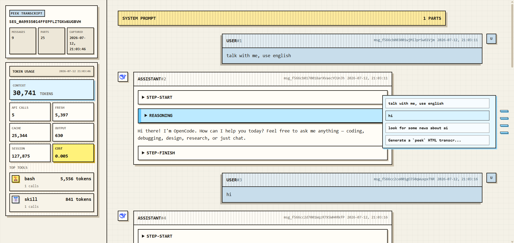

# opencode-kit

<p align="center">
  
</p>

<p align="center">
  Reusable plugins and extensions for <a href="https://opencode.ai">OpenCode</a>.
</p>

<p align="center">
  
  =22">
  =1.17.14">
  
</p>

`opencode-kit` is a monorepo for practical OpenCode extensions. It provides reusable plugins for inspecting sessions, rendering transcripts, and extending agent workflows.

## Packages

| Package | Description | Install |
| --- | --- | --- |
| [`opencode-peek`](./packages/opencode-peek) | Render the current OpenCode session as a readable HTML transcript with token usage and model avatars. | `npm install opencode-peek` |

## Peek

`opencode-peek` turns the current OpenCode session into a readable, interactive HTML transcript.

<p align="center">
  
</p>

## Install

Install the plugin from npm:

```bash
npm install opencode-peek
```

Requirements: Node.js `>=22` and OpenCode `>=1.17.14`.

Add it to the plugin list in your OpenCode configuration without replacing existing plugins:

```json
{
  "plugin": ["opencode-peek"]
}
```

Copy the bundled command template to the current project:

```text
packages/opencode-peek/commands/peek.md
→ .opencode/commands/peek.md
```

Restart OpenCode after changing the configuration.

### Recommended: let your Agent configure it

Send this instruction to your OpenCode Agent:

```text
Install opencode-peek with npm.
Keep the existing OpenCode configuration and add opencode-peek to the plugin list.
Copy the package's commands/peek.md to .opencode/commands/peek.md.
Validate the configuration and tell me to restart OpenCode.
```

## Usage

Run the command in OpenCode:

```text
/peek
```

The command:

1. Inspects the current session.
2. Generates the session report.
3. Renders the HTML transcript.
4. Writes the latest result to `.workspace/cache/peek/latest.html`.

On success, the command returns the absolute path of the generated HTML file.

## Features

- Two-column session transcript layout.
- Token usage and cost details.
- Model-specific avatars.
- Stable colors for custom tools based on tool-name hashing.
- Neutral styling for OpenCode built-in tools.
- Session summaries with configurable message truncation.
- Separate session inspection and HTML rendering stages.
- Extensible visual themes.
- Transparent generated HTML background.

## Generated artifacts

Generated files are stored under `.workspace/cache/`:

```text
.workspace/cache/
├── peek/
│   └── latest.html
└── session-inspect/
    ├── latest.json
    └── latest.md
```

These files are local artifacts and should not be committed.

`session_inspect` prepares structured session data. `peek` renders that data into HTML.

## Repository structure

```text
opencode-kit/
├── assets/                         # Root README assets
├── packages/
│   └── opencode-peek/
│       ├── assets/                 # Package documentation images
│       ├── commands/               # OpenCode command templates
│       ├── dist/                   # Published build output
│       └── README.md               # Package documentation
├── package.json                    # Root workspace configuration
└── README.md                       # This document
```

The root `assets/` directory is used only by this repository README. Package-specific documentation assets live inside the package and are included in the npm tarball when required.

## Development

The repository uses npm workspaces. Each package is independently buildable and publishable.

```bash
npm install
npm run build
npm test
npm run pack:peek -- --dry-run
```

`npm run pack:peek -- --dry-run` verifies the files that will be included in the `opencode-peek` package before publishing.

## Adding a package

1. Create a directory under `packages/`.
2. Add the package to the workspace configuration.
3. Provide a package README and tests.
4. Keep package-specific assets inside the package.
5. Verify the npm tarball before publishing.

## Documentation

- [`opencode-peek` package documentation](./packages/opencode-peek/README.md)
- [`opencode-peek` command template](./packages/opencode-peek/commands/peek.md)

## License

MIT — see [`LICENSE`](./packages/opencode-peek/LICENSE).
