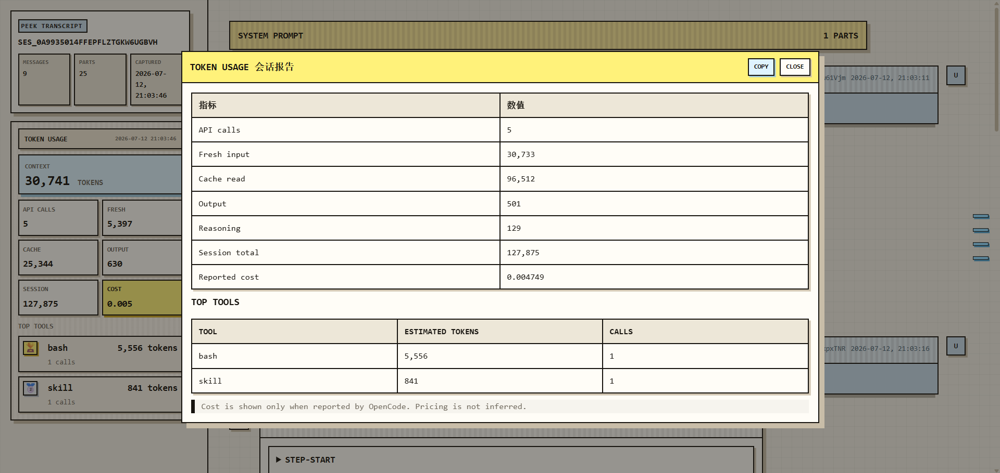

# opencode-peek

`opencode-peek` 是一个可扩展主题的 OpenCode 会话 transcript 插件，提供：

- 当前会话 HTML transcript；
- Token Usage 报告；
- 自定义工具的稳定颜色分配；
- 根据模型识别的本地头像；
- 可扩展的主题渲染基础。

## 效果预览

<div align="center">
  
  <p><em>会话 transcript 与 Token 侧边栏 —— "pixel" 主题</em></p>
</div>

<div align="center">
  
  <p><em>Token 用量详细报告弹窗</em></p>
</div>

## 最推荐：让 Agent 自动安装和配置

把下面这段话直接发给你的 OpenCode Agent：

```text
请安装 npm 插件 opencode-peek，并完成配置：保留现有 OpenCode 配置，在 plugin 中加入 opencode-peek；将包内的 commands/peek.md 写入当前项目的 .opencode/commands/peek.md；验证配置可解析后告诉我重启 OpenCode。
```

Agent 会自动执行 npm 安装、保留现有配置、安装 command，并提示重启 OpenCode。

## 手动配置

也可以直接使用包内的 command 模板：

```text
packages/opencode-peek/commands/peek.md
```

将其复制到当前项目的：

```text
.opencode/commands/peek.md
```

或者在 `opencode.json` 中加入插件和 command。合并到已有配置时不要覆盖原来的 `plugin` 或 `command`：

```json
{
  "$schema": "https://opencode.ai/config.json",
  "plugin": ["opencode-peek"],
  "command": {
    "peek": {
      "description": "Generate an HTML view of the current OpenCode session",
      "template": "Generate a peek HTML transcript for the current session. First call session_inspect to generate a fresh snapshot and token report. Then call peek. Do not pass firstNTurns unless the user explicitly requests the first N turns only. If either tool fails, briefly state the reason and stop. On success, reply only with the absolute htmlPath returned by peek."
    }
  }
}
```

之后使用：

```text
/peek
```

## 产物和隐私

结果写入：

```text
.workspace/cache/peek/latest.html
```

同时会保存 session report、snapshot、system prompt 和工具输出。这些内容可能包含敏感信息，请将以下目录加入项目 `.gitignore`：

```gitignore
.workspace/cache/
```

## 开发

在 `opencode-kit` 仓库根目录执行：

```bash
npm install
npm test
npm run build
npm run pack:peek -- --dry-run
```

当前版本是 `0.1.0`。首个内置主题只是默认主题，后续可以添加其他主题而不改变 session inspect 数据链路。
